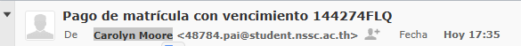
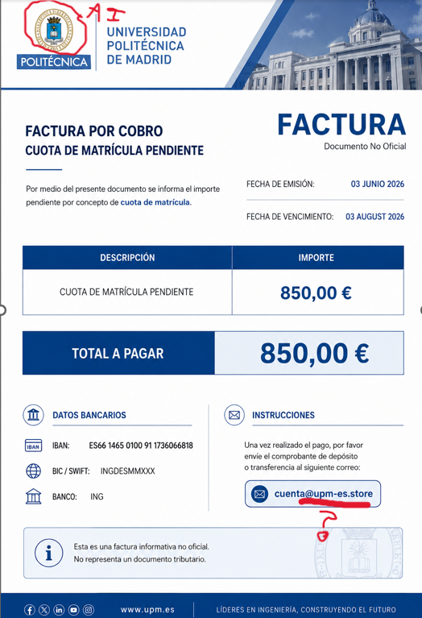
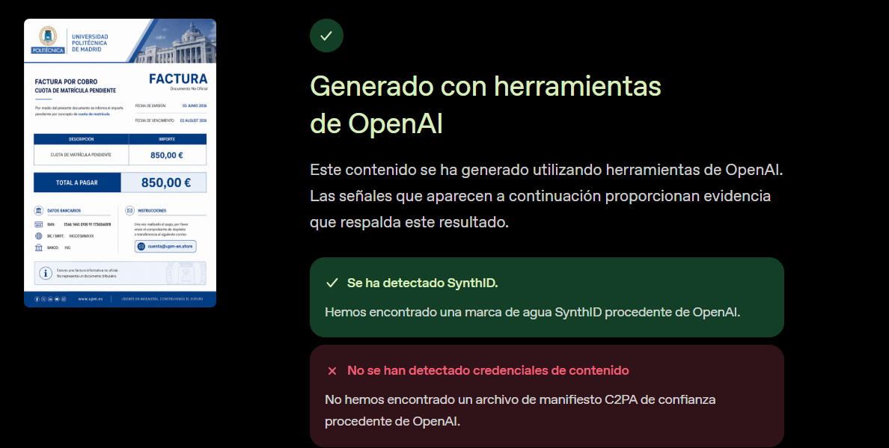
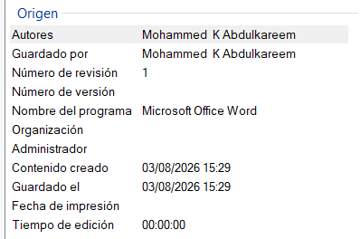
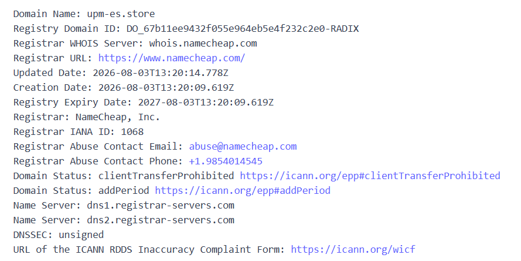
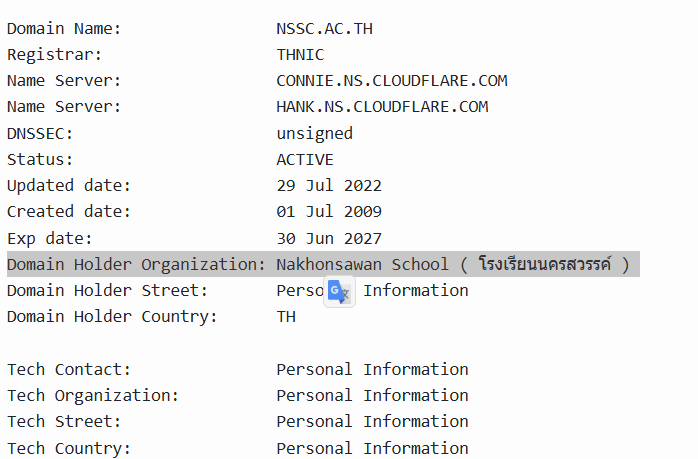
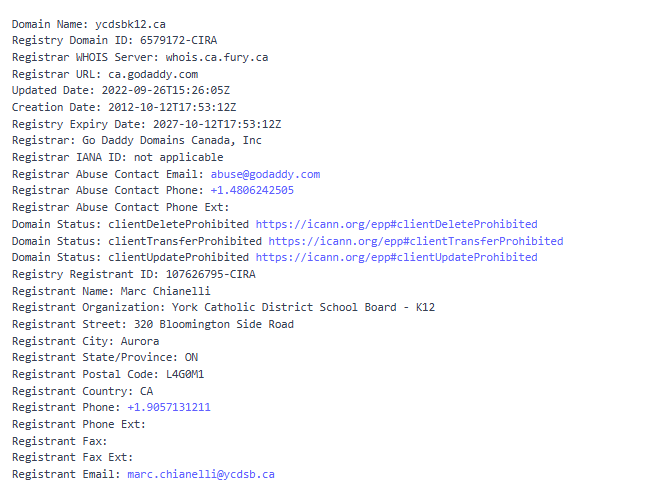

# Anatomy of a Phishing Campaign: How I Investigated an Email Targeting My University

Today I received a phishing email at my university address, so I thought it would make a good example/guide on how you can act in cases like this.

**First, you should never download any attached files or do anything they tell you to do.** These emails usually rely on urgency to make you commit mistakes that you would otherwise never make.

Then, you should report it to the relevant authorities and to your institution's cybersecurity department. In my case, I reported it both to UPM and to INCIBE.

After that, if you want to have some fun, you can use OSINT to find out a few things about your attacker — which is what I'll show here.

---

## 1. The email itself



First things first. We can clearly see that there's something wrong with the email — it's obviously a throwaway account — and we can see the urgency: they notify us that the payment of our university fees is overdue.

They also attach a Word document (in order to avoid being flagged by some systems).

**→ NEVER OPEN IT ON YOUR PERSONAL COMPUTER.**

---

## 2. The attached document



Inside, we can see clear AI artifacts — the "UPM" text in the logo is obviously AI-generated — and the document itself looks off.

---

## 3. Confirming it's AI-generated



From here, we can confirm that it's AI-generated using OpenAI's verification tool:
https://openai.com/es-ES/research/verify/

And it comes back as AI-generated.

---

## 4. The metadata



Then we look at the document's metadata. Apparently it's no longer "Carolyn Moore" (48784.pai@student.nssc.ac.th) who sent it, but rather "Mohhamed K Abdulkareem".

---

## 5. Pivoting to the domain



After this, since there was no other logical route left, I pivoted to looking into the domain they offer for contact: `upm-es.store`. Running a WHOIS lookup on it, I found the following:

```
Updated Date:         2026-08-03T13:20:14.778Z
Creation Date:        2026-08-03T13:20:09.619Z
Registry Expiry Date: 2027-08-03T13:20:09.619Z
```

So it was created today, and registered through https://www.namecheap.com/

Unfortunately, Namecheap hides the registrant's personal information, but it does provide an abuse contact — abuse@namecheap.com — which I obviously emailed, asking them to take the domain down.

---

## 6. The sending domains

Since I couldn't pivot anywhere else, I was stuck, so I decided to gather more information instead. Apparently, the two domains used to spread these emails are always the same two:

**`student.nssc.ac.th`** — the `nssc.ac.th` domain, subdomain `student`. It supposedly belongs to a school in Thailand.



**`ycdsbk12.ca`** — a GoDaddy-registered domain. Also reported, and I pulled its WHOIS as well.



Both of these look like they were compromised a long time ago, since their creation dates are 2022 and earlier. So with near certainty, these are hijacked accounts being used as disposable senders rather than domains the attacker owns.

At this point we can call the OSINT investigation done and report the findings to the authorities, so that they can dig deeper using the bank account and everything else we've provided.

